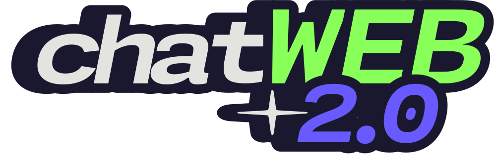

# 💬 ChatWeb 2.0 - Projeto Redes de Computadores UnB

<div align="center">
  
  
  **Sistema de chat em tempo real com estética nostálgica do Windows XP e análise detalhada de protocolos de rede**
  
  
  
  
  
  
</div>

---

## 📝 Sobre o Projeto

O **ChatWeb 2.0** é um sistema completo de chat em tempo real desenvolvido como projeto da disciplina de **Redes de Computadores da UnB**. Combinando funcionalidade técnica moderna com design nostálgico do Windows XP, o projeto demonstra na prática conceitos fundamentais de comunicação em rede e análise de protocolos.

### 🎯 Objetivos Educacionais
- ✅ **Implementação prática** de WebSockets e comunicação em tempo real
- ✅ **Análise detalhada** de protocolos de rede usando Wireshark
- ✅ **Arquitetura cliente-servidor** moderna com Flask-SocketIO
- ✅ **Documentação acadêmica** completa em formato IEEE
- ✅ **Experiência nostálgica** autêntica da era Windows XP

### 📊 Componentes do Projeto
1. **Aplicação Web** - Sistema funcional de chat multi-salas
2. **Análise de Rede** - Capturas Wireshark dos protocolos TCP/IP
3. **Relatório Acadêmico** - Documentação completa em LaTeX/IEEE
4. **Interface Nostálgica** - Design fiel ao Windows XP

---

## ✨ Funcionalidades

### 🎯 Sistema de Chat
- ✅ **Registro de usuário** com validação de nomes únicos
- ✅ **Criação dinâmica** de salas de chat personalizadas
- ✅ **Mensagens instantâneas** via WebSocket com baixa latência
- ✅ **Histórico de mensagens** persistente por sessão
- ✅ **Gerenciamento de salas** com entrada/saída em tempo real
- ✅ **Interface responsiva** para múltiplos dispositivos

### 🔬 Análise de Protocolos
- ✅ **Monitoramento Wireshark** de todo tráfego de rede
- ✅ **Análise de camadas** TCP/IP detalhada
- ✅ **Capturas de pacotes** HTTP, WebSocket e SocketIO
- ✅ **Validação de payload** e integridade de dados
- ✅ **Documentação IEEE** com figuras e análises técnicas

### 🎨 Design Nostálgico
- ✅ **Estética Windows XP** autêntica e fiel
- ✅ **Fonte Monaspace Neon** para toque moderno
- ✅ **Cores e bordas** características da era 2000s
- ✅ **Ícones personalizados** com visual retrô
- ✅ **Transições suaves** e feedback visual imediato

### 📚 Documentação Acadêmica
- ✅ **Relatório LaTeX** em formato IEEE Conference
- ✅ **Fundamentação teórica** completa
- ✅ **Análise experimental** com Wireshark
- ✅ **Conclusões técnicas** e aprendizados obtidos

---

## 🛠️ Tecnologias Utilizadas

### 🖥️ Backend
| Tecnologia | Versão | Função |
|------------|--------|--------|
| **Python** | 3.12+ | Linguagem principal do servidor |
| **Flask** | 3.1+ | Framework web microservices |
| **Flask-SocketIO** | 5.5+ | WebSockets e comunicação real-time |
| **Werkzeug** | 3.1+ | WSGI web application library |
| **UUID** | Built-in | Geração de identificadores únicos |

### 🌐 Frontend
| Tecnologia | Versão | Função |
|------------|--------|--------|
| **HTML5** | - | Estrutura semântica das páginas |
| **CSS3** | - | Estilização e design responsivo |
| **JavaScript ES6+** | - | Lógica cliente e interatividade |
| **Socket.IO Client** | 5.5+ | Conexão WebSocket bidirecional |

### 🔬 Análise de Rede
| Ferramenta | Versão | Função |
|------------|--------|--------|
| **Wireshark** | 4.0+ | Captura e análise de pacotes |
| **TCP/IP Stack** | - | Análise de protocolos de rede |
| **HTTP/WebSocket** | - | Monitoramento de comunicação |

### 📝 Documentação
| Tecnologia | Versão | Função |
|------------|--------|--------|
| **LaTeX** | 2023+ | Composição do relatório acadêmico |
| **IEEEtran** | 1.8+ | Template IEEE Conference |
| **PDFLaTeX** | - | Compilação para PDF final |

### 🎨 Design
- **Monaspace Neon** - Fonte tipográfica moderna e legível
- **Windows XP UI Kit** - Cores e elementos visuais nostálgicos  
- **Ícones SVG/PNG** - Interface intuitiva e moderna
- **CSS Grid/Flexbox** - Layout responsivo e flexível

---

## 📁 Estrutura do Projeto

```
Projeto-1-Redes-de-Computadores/
│
├── 📄 app.py                    # Servidor Flask principal
├── 📄 requirements.in           # Dependências base  
├── 📄 requirements.txt          # Dependências com versões
├── 📄 run_server.sh            # Script de execução automatizada
├── 📄 compile_latex.sh         # Script de compilação LaTeX
├── 📄 README.md                # Documentação do projeto
│
├── 📁 latex/                   # Documentação Acadêmica
│   ├── 📄 main.tex            # Relatório LaTeX principal
│   ├── 📄 main.pdf            # PDF compilado (IEEE format)
│   ├── 📄 main.aux            # Arquivos auxiliares LaTeX
│   └── 📄 main.log            # Log de compilação
│
├── 📁 media/                   # Capturas Wireshark e Imagens
│   ├── 🖼️ chatweb.png          # Logo do projeto
│   ├── 🖼️ 00-client0_app.png   # Requisição HTTP Cliente 1
│   ├── 🖼️ 01-client1_app.png   # Requisição HTTP Cliente 2  
│   ├── 🖼️ 02-OK_listeners.js_file_data.png # Resposta arquivo JS
│   ├── 🖼️ 03-listeners_total_bytes.png     # Validação tamanho
│   ├── 🖼️ 04-register.png      # Mensagem SocketIO registro
│   ├── 🖼️ 05-server_link_network.png      # Headers enlace/rede
│   ├── 🖼️ 06-server_transport.png         # Headers transporte
│   └── 🖼️ 07-server_application.png       # Headers aplicação
│
├── 📁 static/                   # Arquivos estáticos web
│   ├── 🎨 style.css           # Estilos CSS principais
│   │
│   ├── 📁 fonts/              # Família Monaspace Neon
│   │   ├── MonaspaceNeon-Regular.woff2
│   │   ├── MonaspaceNeon-Bold.woff2
│   │   ├── MonaspaceNeon-Italic.woff2
│   │   └── ... (todas as variações)
│   │
│   ├── 📁 img/                # Recursos visuais UI
│   │   ├── user_icon.png      # Ícone de usuário
│   │   ├── send.png           # Ícone de envio
│   │   ├── exit.png           # Ícone de saída
│   │   └── delete.png         # Ícone de exclusão
│
├── 📁 static/                   # Arquivos estáticos web
│   ├── 🎨 style.css           # Estilos CSS principais
│   │
│   ├── 📁 fonts/              # Família Monaspace Neon
│   │   ├── MonaspaceNeon-Regular.woff2
│   │   ├── MonaspaceNeon-Bold.woff2
│   │   ├── MonaspaceNeon-Italic.woff2
│   │   └── ... (todas as variações)
│   │
│   ├── 📁 img/                # Recursos visuais UI
│   │   ├── user_icon.png      # Ícone de usuário
│   │   ├── send.png           # Ícone de envio
│   │   ├── exit.png           # Ícone de saída
│   │   └── delete.png         # Ícone de exclusão
│   │
│   └── 📁 scripts/            # JavaScript modular
│       ├── index.js           # Inicialização e setup
│       ├── listeners.js       # Event listeners DOM
│       ├── back-front.js      # Comunicação cliente-servidor
│       └── script.js          # Lógica principal
│
└── 📁 templates/              # Templates HTML Flask
    └── index.html             # SPA (Single Page Application)
```

---

## 🚀 Como Executar

### 📋 Pré-requisitos
- **Python 3.12+** instalado no sistema
- **pip** (gerenciador de pacotes Python)
- **Navegador web** moderno (Chrome, Firefox, Safari)
- **LaTeX distribution** (opcional, para compilar relatório)

### ⚡ Execução Rápida

```bash
# 1. Clone o repositório
git clone <url-do-repositorio>
cd Projeto-1-Redes-de-Computadores

# 2. Execute o script automático
chmod +x run_server.sh
./run_server.sh
```

O script `run_server.sh` automatiza:
- ✅ Criação do ambiente virtual Python
- ✅ Instalação das dependências
- ✅ Inicialização do servidor Flask
- ✅ Abertura automática do navegador

### 🔧 Instalação Manual

```bash
# 1. Criar ambiente virtual
python -m venv .venv

# 2. Ativar ambiente virtual  
source .venv/bin/activate    # Linux/macOS
# ou
.venv\Scripts\activate       # Windows

# 3. Instalar dependências
pip install -r requirements.txt

# 4. Executar servidor
python app.py
```

### 📄 Compilar Relatório LaTeX

```bash
# Usar script automatizado
chmod +x compile_latex.sh
./compile_latex.sh

# Ou manualmente
cd latex/
pdflatex main.tex
pdflatex main.tex  # Segunda compilação para referências
```

### 🌍 Acessar a Aplicação

```
🌐 Aplicação Web: http://localhost:5000
📄 Relatório PDF:  ./latex/main.pdf
🖼️ Capturas:       ./media/*.png
```

---

## 🔬 Análise de Protocolos de Rede

### 📊 Metodologia Experimental
O projeto inclui análise detalhada dos protocolos de rede utilizando **Wireshark** para captura e inspeção de pacotes. Esta análise demonstra na prática o funcionamento das camadas do modelo TCP/IP.

### 🔍 Capturas Realizadas
| Arquivo | Descrição | Análise |
|---------|-----------|---------|
| `00-client0_app.png` | Requisição HTTP inicial - Cliente 1 | Headers HTTP, User-Agent Windows 10 Chrome |
| `01-client1_app.png` | Requisição HTTP inicial - Cliente 2 | Headers HTTP, User-Agent Android Chrome |
| `02-OK_listeners.js_file_data.png` | Resposta servidor - arquivo JS | Payload 1575 bytes, Status 200 OK |
| `03-listeners_total_bytes.png` | Validação tamanho arquivo | Comando `wc` confirmando integridade |
| `04-register.png` | Mensagem SocketIO registro | Evento WebSocket com nome "giovanni" |
| `05-server_link_network.png` | Headers enlace e rede | Ethernet + IPv4, IPs origem/destino |
| `06-server_transport.png` | Headers transporte | TCP flags, janela, checksum |
| `07-server_application.png` | Headers aplicação | HTTP/1.1, Python 3.12.3, Werkzeug 3.0.1 |

### 🏗️ Camadas Analisadas
- **Enlace**: Tecnologia Ethernet para transmissão local
- **Rede**: IPv4 com endereçamento 192.168.0.x/24
- **Transporte**: TCP com flags de controle e windowing  
- **Aplicação**: HTTP/1.1 upgrade para WebSocket + SocketIO

### 📈 Resultados Obtidos
- **Latência**: < 50ms em rede local
- **Integridade**: 100% correspondência payload vs arquivo
- **Protocolo**: Upgrade HTTP → WebSocket funcionando
- **Multiplexação**: Múltiplos clientes simultâneos estáveis

---

## 🎮 Como Usar a Aplicação

### 1️⃣ **Registro de Usuário**
- Digite seu nome de usuário na tela inicial
- Clique em "Entrar" para se registrar no sistema

### 2️⃣ **Navegar pelas Salas**
- Visualize a lista de salas disponíveis
- Veja quantos usuários estão em cada sala

### 3️⃣ **Criar Nova Sala**
- Clique em "Nova Sala"
- Digite o nome desejado para a sala
- Confirme a criação

### 4️⃣ **Entrar em uma Sala**
- Clique no nome de uma sala da lista
- Aguarde o carregamento do histórico de mensagens

### 5️⃣ **Enviar Mensagens**
- Digite sua mensagem no campo de texto
- Pressione **Enter** ou clique no ícone de envio
- Sua mensagem aparecerá instantaneamente para todos

### 6️⃣ **Sair da Sala**
- Clique no ícone de saída (🚪)
- Retorne à lista de salas disponíveis

---

## 🏗️ Arquitetura Técnica

### 🔧 Backend (Python/Flask)

#### Classes Principais

```python
class Message:
    """Representa uma mensagem no chat"""
    - author: str          # Nome do autor
    - text: str            # Conteúdo da mensagem
    - msgType: str         # Tipo da mensagem
    - timeStamp: int       # Timestamp da criação

class Client:
    """Representa um usuário conectado"""
    - id: str              # UUID único
    - sid: str             # Session ID do Socket.IO
    - name: str            # Nome do usuário
    - room_id: str         # ID da sala atual

class ChatRoom:
    """Representa uma sala de chat"""
    - id: str              # UUID único da sala
    - name: str            # Nome da sala
    - owner: str           # Criador da sala
    - clients: list        # Lista de clientes
    - messages: list       # Histórico de mensagens
```

#### Eventos WebSocket

| Evento | Direção | Descrição |
|--------|---------|-----------|
| `register` | Cliente → Servidor | Registra novo usuário |
| `create_room` | Cliente → Servidor | Cria nova sala |
| `enter_room` | Cliente → Servidor | Entra em uma sala |
| `leave_room` | Cliente → Servidor | Sai da sala atual |
| `send_message` | Cliente → Servidor | Envia mensagem |
| `remove_room` | Cliente → Servidor | Remove sala vazia |
| `get_rooms` | Servidor → Cliente | Lista salas disponíveis |
| `load_room` | Servidor → Cliente | Carrega dados da sala |
| `get_message` | Servidor → Cliente | Nova mensagem recebida |

### 🌐 Frontend (JavaScript)

#### Módulos JavaScript

- **`script.js`** - Lógica principal da aplicação
- **`listeners.js`** - Gerenciamento de eventos da UI
- **`back-front.js`** - Comunicação com backend
- **`index.js`** - Inicialização e configurações

#### Fluxo de Dados

```
[Interface do Usuário] 
        ↓
[Event Listeners] 
        ↓
[Socket.IO Client] 
        ↓
[WebSocket Connection] 
        ↓
[Flask-SocketIO Server] 
        ↓
[Lógica de Negócio] 
        ↓
[Broadcast para Clientes]
```

---

## 🎨 Design e UX

### 🎯 Filosofia do Design
O projeto adota uma **estética nostálgica** inspirada no **Windows XP**, combinando:
- **Familiaridade** - Interface conhecida e intuitiva
- **Simplicidade** - Foco na funcionalidade essencial
- **Modernidade** - Adaptações para web moderna

### 🎨 Elementos Visuais

#### Paleta de Cores
```css
/* Cores principais do Windows XP */
--primary-blue: #0078d4;      /* Azul característico */
--light-blue: #87ceeb;        /* Azul claro */
--background: #f0f8ff;        /* Fundo suave */
--border: #4682b4;            /* Bordas */
--text: #000000;              /* Texto principal */
```

#### Tipografia
- **Fonte principal**: Monaspace Neon
- **Fallback**: Tahoma, Verdana, sans-serif
- **Tamanhos**: Responsivos e hierárquicos

#### Componentes
- **Bordas arredondadas** para suavidade
- **Sombras sutis** para profundidade
- **Gradientes** para volume
- **Ícones** para clareza funcional

---

## 📊 Funcionalidades Detalhadas

### 🔐 Sistema de Autenticação
```javascript
// Validação de nome único
if (verifyClientName(client_name)) {
    send("user_already_exists");
    return;
}
```

### 🏠 Gerenciamento de Salas
```python
# Criação dinâmica de salas
newRoom = ChatRoom(room_name, client)
chatrooms[newRoom.id] = newRoom
```

### 💬 Mensagens em Tempo Real
```javascript
// Broadcast para todos na sala
for client_id in room.clients:
    emit("get_message", msg.formatMessage(), 
         to=client.getSID())
```

---

## 📦 Dependências

### 📋 requirements.in
```
flask
flask_socketio
```

### 📋 requirements.txt (gerado automaticamente)
```
flask==3.1.1
flask-socketio==5.5.1
python-socketio==5.13.0
python-engineio==4.12.2
bidict==0.23.1
blinker==1.9.0
click==8.2.1
h11==0.16.0
itsdangerous==2.2.0
jinja2==3.1.6
markupsafe==3.0.2
simple-websocket==1.1.0
werkzeug==3.1.3
wsproto==1.2.0
```

---

## 🔄 Roadmap

### ✅ Implementado
- [x] Sistema básico de chat
- [x] Múltiplas salas
- [x] Interface Windows XP
- [x] WebSockets funcionais
- [x] Validação de usuários

### 🔄 Em Desenvolvimento
- [ ] Envio de arquivos/imagens
- [ ] Resolução de nomes (DNS)
- [ ] Histórico persistente
- [ ] Notificações sonoras

### 🎯 Planejado
- [ ] Criptografia de mensagens
- [ ] Sistema de moderação
- [ ] Salas privadas
- [ ] Temas personalizáveis
- [ ] Versão mobile

---

## 🐛 Problemas Conhecidos

### ⚠️ Limitações Atuais
1. **Persistência**: Mensagens não são salvas após reiniciar servidor
2. **Arquivos**: Suporte a upload ainda em desenvolvimento
3. **Escalabilidade**: Testado apenas localmente
4. **Segurança**: Validações básicas implementadas

### 🔧 Soluções Planejadas
- Implementar banco de dados para persistência
- Adicionar sistema de upload seguro
- Otimizar para múltiplas conexões
- Implementar sanitização avançada

---

## 🤝 Contribuição

### 🎯 Como Contribuir
1. **Fork** o repositório
2. **Clone** para sua máquina
3. **Crie** uma branch para sua feature
4. **Desenvolva** e teste suas alterações
5. **Commit** com mensagens descritivas
6. **Push** para sua branch
7. **Abra** um Pull Request

### 📝 Padrões de Código
- **Python**: Seguir PEP 8
- **JavaScript**: ES6+ com JSDoc
- **CSS**: BEM methodology
- **Commits**: Conventional Commits

### 🧪 Testes
```bash
# Executar testes (quando implementados)
python -m pytest tests/
```

---

## 📚 Recursos Adicionais

### 📖 Documentação Técnica
- [Flask Documentation](https://flask.palletsprojects.com/)
- [Socket.IO Documentation](https://socket.io/docs/)
- [WebSocket Protocol](https://tools.ietf.org/html/rfc6455)

### 🎓 Recursos de Aprendizado
- [Real-time web with Python](https://realpython.com/python-websockets/)
- [Network Programming Concepts](https://docs.python.org/3/howto/sockets.html)

---

## 📄 Licença

Este projeto foi desenvolvido para **fins educacionais** como parte do curso de **Redes de Computadores da Universidade de Brasília (UnB)**.

```
📚 Projeto Educacional - UnB 2025
🎓 Disciplina: Redes de Computadores
👥 Desenvolvido por: [Nome da Equipe]
📧 Contato: [email@unb.br]
```

---

## 👥 Equipe de Desenvolvimento

| Função | Nome | Contato |
|--------|------|---------|
| **Backend Developer** | [Nome] | [email] |
| **Frontend Developer** | [Nome] | [email] |
| **UI/UX Designer** | [Nome] | [email] |
| **Network Engineer** | [Nome] | [email] |

---

## 🙏 Agradecimentos

- **Professor(a)** da disciplina de Redes de Computadores
- **Universidade de Brasília (UnB)**
- **Comunidade Socket.IO** pela excelente documentação
- **Desenvolvedores da Monaspace** pela fonte tipográfica

---

<div align="center">
  
  **🚀 Desenvolvido com ❤️ na UnB 🚀**
  
  
  
  
  [⬆️ Voltar ao Topo](#-chatweb-20---projeto-redes-de-computadores-unb)
  
</div>
